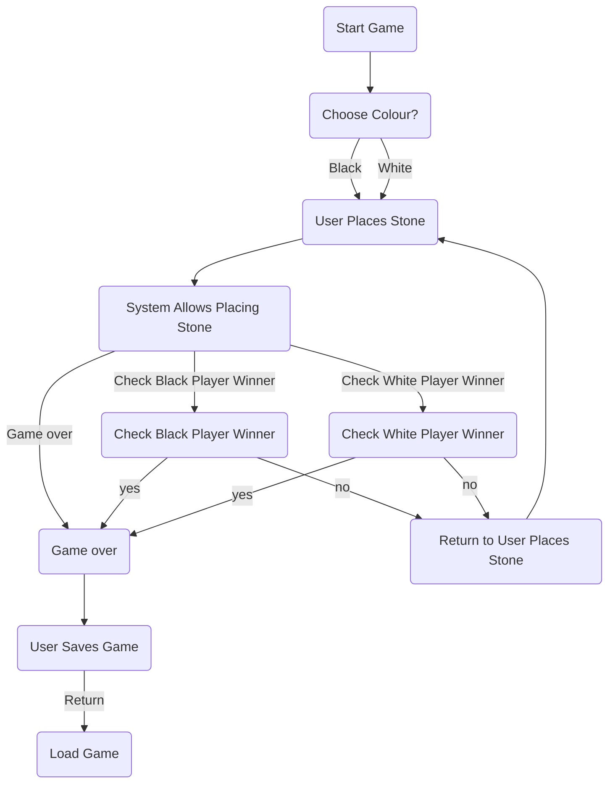

# Use cases: Reversi
<!--
## Use case: XYZ

| **Actors**                       |        |
| -------------------------------- | ------ |
| Primary actors                   |        |
| Secondary actors                 |        |
| **Preconditions**                |        |
| **Scenario sketch**              |        |
| Standard flow                    | Step 1 |
|                                  | Step 2 |
|                                  | Step 3 |
|                                  | ...    |
| Alternative / exceptional flow 1 | Step 1 |
|                                  | ...    |
| **Postconditions**               |        |
-->

### Use case: Start game

| **Actors**                       |        |
| -------------------------------- | ------ |
| Primary actors                   |     User   |
| Secondary actors                 |   System     |
| Standard flow          | 1. User selects "Start game" option. |
|                        | 2. User makes selections for color and number of players. |
|                        | 3. System initializes board and pieces. |
| **Postconditions**     | Game board is set up for play. |

## Use case: Place stone

| **Actors**             | User, System |
| ---------------------- | -------------- |
| **Preconditions**      | Game board is set up. It is currently one player's turn. |
| **Scenario sketch**    | User places a stone on the board. |
| Standard flow          | 1. User selects a valid position to place their stone. |
|                        | 2. System includes "Choose the position" action for both user and system. |
|                        | 3. User and system make selections. |
|                        | 4. System places the stone on the selected position. |
| **Postconditions**     | Board state is updated with the new stone placement. Turn switches to the next player. |

**Note:** Black stone starts first.

### Use case: Check winner

| **Actors**             | System |
| ---------------------- | ------ |
| **Preconditions**      | Game is ended. |
| **Scenario sketch**    | System checks for a winner. |
| Standard flow          | 1. System analyzes the final board state to determine if there is a winner. |
|                        | 2. If a winner is found, system declares the winner. |
| **Postconditions**     | Result of the game is displayed (winner or loser). |

### Use case: Save game

| **Actors**             | User, System |
| ---------------------- | -------------- |
| **Preconditions**      | Game is in progress. |
| **Scenario sketch**    | User or system saves the current game state. |
| Standard flow          | 1. User selects "Save game" option. |
|                        | 2. System prompts for a file name or slot to save the game. |
|                        | 3. User or system provides a file name or selects a save slot. |
|                        | 4. System saves the game state to the specified location. |
| **Postconditions**     | Game state is saved and can be loaded later. |

### Use case: End game

| **Actors**             | User, System |
| ---------------------- | -------------- |
| **Preconditions**      | Game is in progress. |
| **Scenario sketch**    | User or system chooses to end the current game. |
| Standard flow          | 1. User selects "End game" option. |
|                        | 2. System confirms the user's choice. |
|                        | 3. System terminates the current game. |
| **Postconditions**     | Game is saved. Users have the option to return to the initial state or load a previously saved game. |

### Use case: Load game

| **Actors**             | User, System |
| ---------------------- | -------------- |
| **Preconditions**      | None |
| **Scenario sketch**    | User or system loads a previously saved game. |
| Standard flow          | 1. User selects "Load game" option. |
|                        | 2. System presents a list of saved games. |
|                        | 3. User or system selects the game they want to load. |
|                        | 4. System loads the selected game state. |
| **Postconditions**     | Game state is loaded and users can resume play from where they left off. |

---

---

