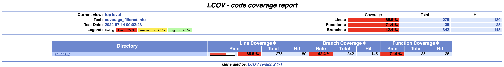

```markdown
# Laborprotokoll zur Test-Coverage

## Aufgabe

1. **Installation eines Werkzeugs zur Prüfung der Test-Coverage**
2. **Anwendung des Werkzeugs auf Tests einer mittelkomplexen Funktion**
3. **Dokumentation der Vorgehensweise und Ergebnisse**

## 1. Installation eines Werkzeugs zur Prüfung der Test-Coverage

Zur Ermittlung der Test-Coverage wurde `gcov` und `lcov` verwendet. Diese Werkzeuge wurden gemäß den im Laborvortrag gegebenen Anleitungen installiert.

### Installation von lcov

   ```bash
   brew install lcov
   ```

## 2. Anwendung des Werkzeugs auf Tests einer mittelkomplexen Funktion

Die Tests wurden auf die Funktion `GameManager::play()` angewendet. Diese Funktion wurde gewählt, da sie eine mittlere Komplexität aufweist und mehrere Verzweigungen und Bedingungen enthält.

### Vorbereitung

1. **Compiler-Flags und Optionen für gcov hinzufügen**

   Die folgenden Flags wurden den Compiler-Optionen (CFLAG in Makefile) hinzugefügt:

    ```bash
    -g -O0 --coverage
    ```

2. **Kompilieren**

   Das Projekt wurde mit den Coverage-Flags kompiliert:

    ```bash
    g++ -Wall -Wextra -std=c++14 -g -O0 --coverage -Isrc/reversi -o output/runTests src/reversi/*.cpp -lgtest -lgtest_main -pthread
    ```

3. **Ausführen der Tests**

   Die Tests wurden ausgeführt, um die Coverage-Daten zu generieren (*.gcno und *.gcda Dateien):

    ```bash
    ./output/runTests
    ```

### Durchführung der Coverage-Analyse

1. **Einlesen der Coverage-Daten und Erstellen eines Reports**

    ```bash
    lcov --capture --directory . --output-file coverage.info --rc lcov_branch_coverage=1 --ignore-errors inconsistent,deprecated
    ```

2. **Filtern der Daten aus der Report-Datei**

    ```bash
    lcov -e coverage.info -o coverage_filtered.info 'src/reversi/*' --rc lcov_branch_coverage=1 --ignore-errors deprecated
    ```

3. **Generieren eines HTML-Reports**

    ```bash
    genhtml --branch-coverage --highlight --legend coverage_filtered.info --output-directory html --rc lcov_branch_coverage=1
    ```

## 3. Dokumentation der Vorgehensweise und Ergebnisse

### Anweisungstest

Die Anweisungstests zielen darauf ab, jede Anweisung in der Funktion mindestens einmal auszuführen. Hier sind die durchgeführten Anweisungstests:

- **Test 1:** Starten eines neuen Spiels und Überprüfen der Spielinitialisierung.
- **Test 2:** Ausführen eines vollständigen Spiels mit zufälligen, aber gültigen Zügen.
- **Test 3:** Beenden des Spiels nach einem vollen Spielfeld.

### Zweigtest

Die Zweigtests zielen darauf ab, jede mögliche Verzweigung in der Funktion mindestens einmal zu durchlaufen. Hier sind die durchgeführten Zweigtests:

- **Test 1:** Überprüfen, ob das Spiel korrekt zwischen Spieler und Computer wechselt.
- **Test 2:** Überprüfen, ob das Spiel korrekt endet, wenn keine gültigen Züge mehr möglich sind.
- **Test 3:** Überprüfen der Spielzustände nach jedem Zug.

### MCDC-Test

Die MCDC-Tests (Modified Condition/Decision Coverage) zielen darauf ab, jede Bedingung in einer Verzweigung separat zu testen, um alle möglichen Kombinationen von Bedingungen abzudecken. Hier sind die durchgeführten MCDC-Tests:

- **Test 1:** Überprüfen, ob das Spiel korrekt erkennt, wenn ein Spieler keinen gültigen Zug mehr hat.
- **Test 2:** Überprüfen der Spielzustände, wenn das Spiel in eine Sackgasse gerät.
- **Test 3:** Überprüfen der Funktionalität, wenn der Spieler versucht, einen ungültigen Zug zu machen.

### Ergebnisse der Coverage-Analyse

#### Übersicht

- **Zeilenabdeckung**: 65.5%
- **Funktionsabdeckung**: 71.4%
- **Zweigabdeckung**: 42.4%

#### Detailansicht

| Datei         | Zeilenabdeckung | Zweigabdeckung | Funktionsabdeckung |
|---------------|-----------------|----------------|--------------------|
| reversi/      | 65.5%           | 42.4%          | 71.4%              |

### Bildschirmfoto der Coverage-Ergebnisse



```